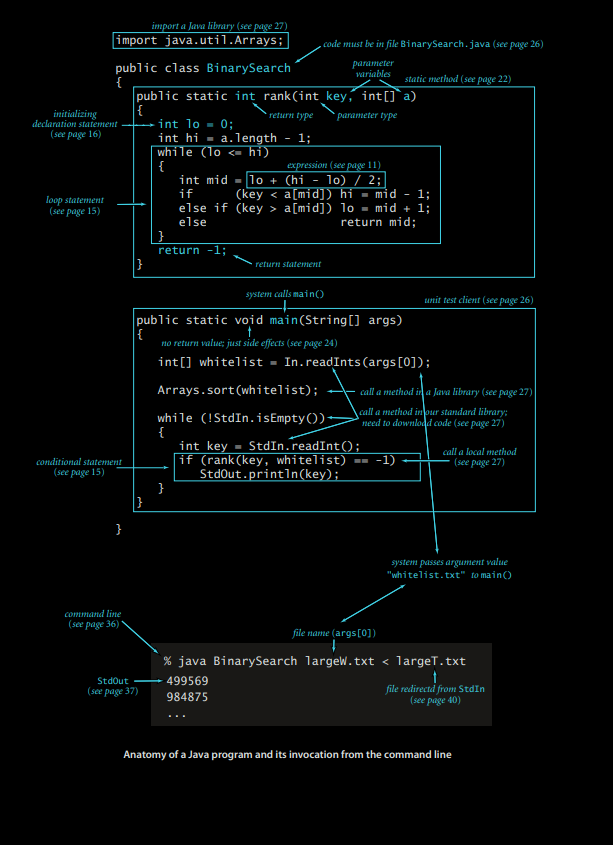
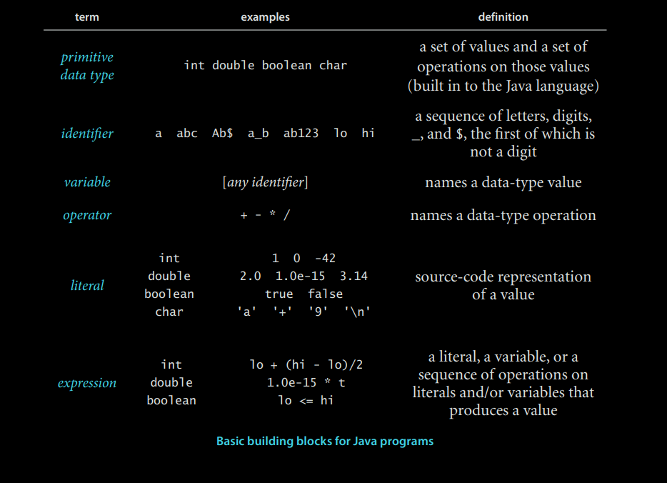
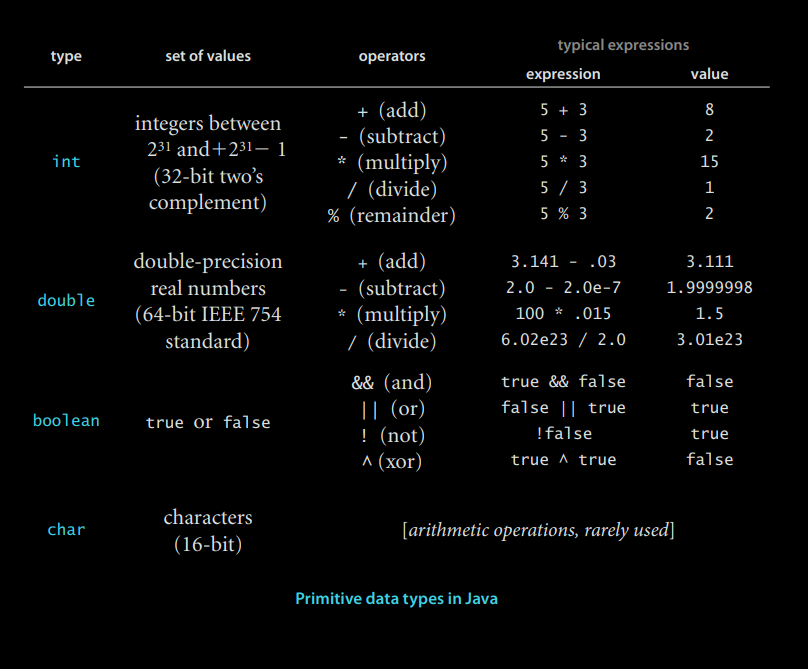
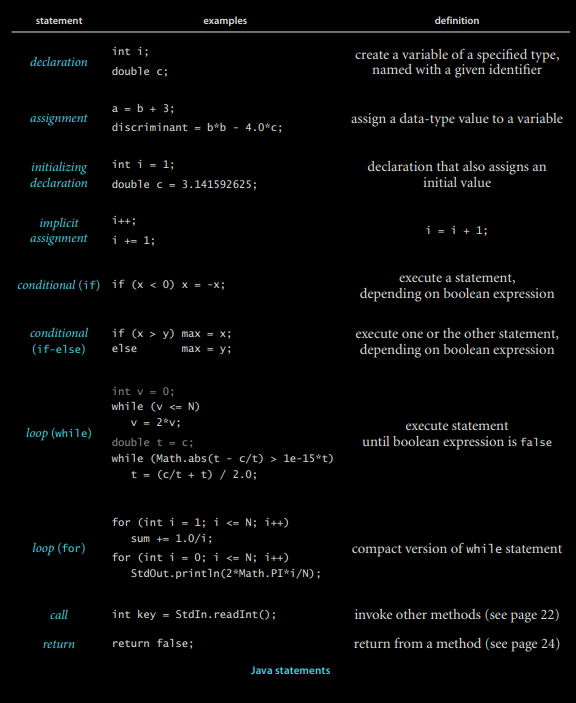
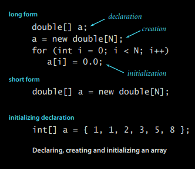
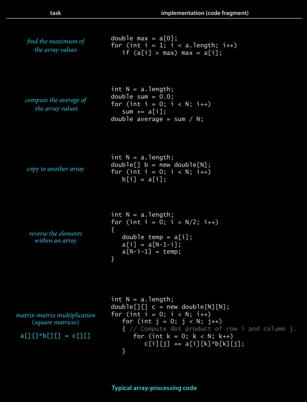
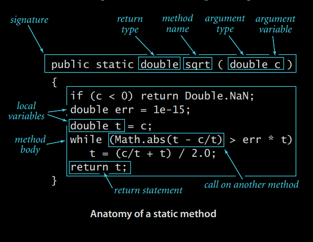
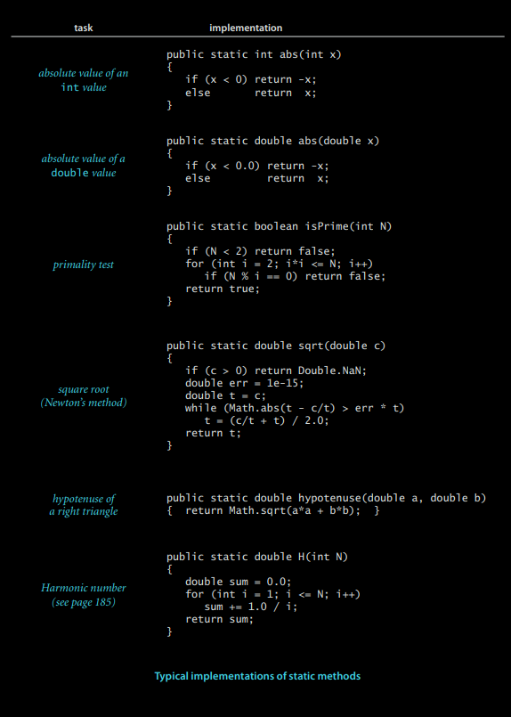

# Modelos básicos de programación

Nuestro estudio de algoritmos se basa en implementarlos como programas escritos en el lenguaje de programación Java.   
Lo hacemos por varias razones:  
- Nuestros programas son descripciones concisas, elegantes y completas de algoritmos.
- Puede ejecutar los programas para estudiar las propiedades de los algoritmos. 
- Puede aplicar los algoritmos inmediatamente en sus aplicaciones. 

Estas son ventajas importantes y significativas sobre las alternativas de trabajar con descripciones de algoritmos en inglés.  

Una posible desventaja de este enfoque es que debemos trabajar con un lenguaje de programación específico,  
lo que posiblemente dificulte separar la idea del algoritmo de los detalles de su implementación.   
Nuestras implementaciones están diseñadas para mitigar esta dificultad mediante el uso de estructuras de programación presentes en muchos lenguajes modernos y necesarias para describir adecuadamente los algoritmos.   

Usamos solo un pequeño subconjunto de Java.  
Si bien no llegamos a definir formalmente el subconjunto que utilizamos, observará que usamos relativamente pocas construcciones de Java y que enfatizamos las que se encuentran en muchos lenguajes de programación modernos.   
El código que presentamos está completo y esperamos que lo descargue y lo ejecute en nuestros datos de prueba o en los datos de prueba que elija.   

Nos referimos a las construcciones de programación, bibliotecas de software y características del sistema operativo que utilizamos para implementar y describir algoritmos como nuestro modelo de programación.  
En esta sección y en la Sección 1.2, describimos completamente este modelo de programación.   
El tratamiento es independiente y está destinado principalmente a la documentación y como referencia para la comprensión del código del libro.   
El modelo que describimos es el mismo que se presenta en nuestro libro Introducción a la Programación en Java: Un Enfoque Interdisciplinario, que ofrece una introducción más pausada al material.   

Como referencia, la figura de la página siguiente muestra un programa Java completo que ilustra muchas de las características básicas de nuestro modelo de programación.  
Usamos este código como ejemplo al analizar las características del lenguaje, pero lo analizamos en detalle en la página 46 (implementa un algoritmo clásico conocido como búsqueda binaria y lo prueba para una aplicación conocida como filtrado de lista blanca).  
Asumimos que tiene experiencia programando en algún lenguaje moderno, por lo que probablemente reconocerá muchas de estas características en este código.   
Se incluyen referencias a las páginas en las anotaciones para ayudarle a encontrar respuestas a cualquier pregunta que pueda tener.   
Dado que nuestro código es algo estilizado y nos esforzamos por usar de forma consistente diversos modismos y construcciones de Java, vale la pena, incluso para programadores Java con experiencia, leer la información de esta sección.  


<source media="(prefers-color-scheme: dark)" srcset="./ejemplo_1_java_structure_dark.png">
<source media="(prefers-color-scheme: light)" srcset="./ejemplo_1_java_structure_light.png">



********

## Estructura básica de un programa java

Un programa Java (clase) es una biblioteca de métodos estáticos (funciones) o una definición de tipo de datos.   
Para crear bibliotecas de métodos estáticos y definiciones de tipos de datos, utilizamos los siguientes cinco componentes, la base de la programación en Java y muchos otros lenguajes modernos:  
- Los tipos de datos primitivos definen con precisión el significado de términos como entero, número real y valor booleano dentro de un programa informático.   
 Su definición incluye el conjunto de valores posibles y las operaciones con dichos valores, que pueden combinarse en expresiones similares a las expresiones matemáticas que definen valores.
- Las sentencias permiten definir un cálculo creando y asignando valores a variables, controlando el flujo de ejecución o generando efectos secundarios.   
  Utilizamos seis tipos de sentencias: 
   - declaraciones
   - asignaciones
   - condicionales
   - bucles
   - llamadas 
   - retornos 

- Los arrays permiten trabajar con múltiples valores del mismo tipo. 
- Los métodos estáticos permiten encapsular y reutilizar código, y desarrollar programas como un conjunto de módulos independientes.  
- Las cadenas son secuencias de caracteres. Algunas operaciones con ellas están integradas en Java.
- La entrada/salida establece la comunicación entre los programas y el mundo exterior.  
- La abstracción de datos extiende la encapsulación y la reutilización para permitirnos definir tipos de datos no primitivos, apoyando así la programación orientada a objetos.  

En esta sección, consideraremos los primeros cinco por orden.  
La abstracción de datos es el tema de la siguiente sección.   
Ejecutar un programa Java implica interactuar con un sistema operativo o un entorno de desarrollo de programas.  
Para mayor claridad y economía, describimos estas acciones en términos de una terminal virtual, donde interactuamos con los programas escribiendo comandos al sistema.   
Consulte el sitio web del libro para obtener detalles sobre el uso de una terminal virtual en su sistema o para obtener información sobre el uso de uno de los muchos entornos de desarrollo de programas más avanzados disponibles en los sistemas modernos.  
Por ejemplo, BinarySearch consta de dos métodos estáticos: rank() y main().  
El primer método estático, rank(), consta de cuatro sentencias: dos declaraciones, un bucle (que a su vez es una asignación y dos condicionales) y un retorno.  
El segundo, main(), consta de tres sentencias: una declaración, una llamada y un bucle (que a su vez es una asignación y un condicional).  
Para invocar un programa Java, primero lo compilamos con el comando javac y luego lo ejecutamos con el comando java.   
Por ejemplo, para ejecutar BinarySearch, primero escribimos el comando javac BinarySearch.java (que crea un archivo BinarySearch.class que contiene una versión de nivel inferior del programa en código de bytes de Java en el archivo BinarySearch.class).   
Luego, escribimos java BinarySearch (seguido de un nombre de archivo de lista blanca) para transferir el control a la versión de código de bytes del programa.   
Para desarrollar una base que nos permita comprender el efecto de estas acciones, a continuación consideramos en detalle los tipos de datos y expresiones primitivos, los distintos tipos de sentencias Java, matrices, métodos estáticos, cadenas y entrada/salida.  

********

## Tipos de datos y expresiones primitivos.  

Un tipo de dato es un conjunto de valores y un conjunto de operaciones sobre dichos valores.   Comenzamos considerando los siguientes cuatro tipos de datos primitivos, que constituyen la base del lenguaje Java:  
- Integers, con operaciones aritméticas (int)
- Números reales, también con operaciones aritméticas (double)
- Booleans, el conjunto de valores {true, false} con operaciones lógicas (boolean)
- Characters, los caracteres alfanuméricos y los símbolos que se escriben (char)

A continuación, consideramos los mecanismos para especificar valores y operaciones para estos tipos.  
Un programa Java manipula variables nombradas con identificadores.  
Cada variable está asociada a un tipo de dato y almacena uno de los valores permitidos.  
En código Java, utilizamos expresiones, similares a las expresiones matemáticas habituales, para aplicar las operaciones asociadas a cada tipo.   
Para los tipos primitivos, utilizamos identificadores para referirnos a las variables, símbolos de operador como + - * / para especificar operaciones, literales como 1 o 3.14 para especificar valores y expresiones como (x + 2.236)/2 para especificar operaciones sobre valores.  
El propósito de una expresión es definir uno de los valores del tipo de dato.  

<source media="(prefers-color-scheme: dark)" srcset="./ejemplo_2_data_types_dark.png">
<source media="(prefers-color-scheme: light)" srcset="./ejemplo_2_data_types_light.png">


Para definir un tipo de dato, solo necesitamos especificar los valores y el conjunto de operaciones sobre esos valores.  
Esta información se resume en la tabla a continuación para los tipos de datos int, double, boolean y char de Java.  
Estos tipos de datos son similares a los tipos de datos básicos que se encuentran en muchos lenguajes de programación.  
Para int y double, las operaciones son operaciones aritméticas comunes; para boolean, son operaciones lógicas comunes.  
Es importante tener en cuenta que +, -, * y / están sobrecargados: el mismo símbolo especifica operaciones en múltiples tipos diferentes, según el contexto.   
La propiedad clave de estas operaciones primitivas es que una operación que involucra valores de un tipo dado tiene un valor de ese tipo.  
Esta regla resalta la idea de que a menudo trabajamos con valores aproximados, ya que a menudo el valor exacto que parecería estar definido por la expresión no es un valor del tipo.   
Por ejemplo, 5/3 tiene el valor 1 y 5.0/3.0 tiene un valor muy cercano a 1.6666666666667, pero ninguno de estos es exactamente igual a 5/3.   
Esta tabla no está completa; analizamos algunos operadores adicionales y diversas situaciones excepcionales que ocasionalmente debemos considerar en las preguntas y respuestas al final de esta sección.

<source media="(prefers-color-scheme: dark)" srcset="ejemplo_3_primitive_Data_type_dark.png">
<source media="(prefers-color-scheme: light)" srcset="ejemplo_3_primitive_Data_type_light.png">
    

********

**Expresiones:**.  
Como se ilustra en la tabla al final de la página anterior, las expresiones típicas son infijas: un literal (o una expresión), seguido de un operador, seguido de otro literal (u otra expresión).  
Cuando una expresión contiene más de un operador, el orden en que se aplican suele ser significativo, por lo que las siguientes convenciones de precedencia forman parte de la especificación del lenguaje Java: Los operadores * y / (y %) tienen mayor precedencia que (se aplican antes que) los operadores + y -; entre los operadores lógicos, ! es el de mayor precedencia, seguido de && y ||. Generalmente, los operadores con la misma precedencia se aplican de izquierda a derecha.  
Al igual que en las expresiones aritméticas estándar, se pueden usar paréntesis para anular estas reglas.   
Dado que las reglas de precedencia varían ligeramente entre lenguajes, usamos paréntesis y, de lo contrario, nos esforzamos por evitar la dependencia de las reglas de precedencia en nuestro código.    

********

**Conversión de tipo**.  
Los números se convierten automáticamente a un tipo más inclusivo si no se pierde información.  
Por ejemplo, en la expresión 1 + 2.5, el 1 se convierte al valor doble 1.0 y la expresión se evalúa como el valor doble 3.5.  
Una conversión es un nombre de tipo entre paréntesis dentro de una expresión, una directiva para convertir el siguiente valor en un valor de ese tipo.   
Por ejemplo, (int) 3.7 es 3 y (double) 3 es 3.0. Tenga en cuenta que la conversión a un int es truncamiento en lugar de redondeo; las reglas para la conversión dentro de expresiones complejas pueden ser complejas, y las conversiones deben usarse con moderación y cuidado.   
Una práctica recomendada es usar expresiones que involucren literales o variables de un solo tipo.   

********

**Comparaciones**.  
Los siguientes operadores comparan dos valores del mismo tipo y producen un valor booleano: igual (==), distinto (!=), menor que (<), menor o igual (<=), mayor que (>) y mayor o igual (>=).  
Estos operadores se conocen como operadores de tipo mixto porque su valor es booleano, no el tipo de los valores que se comparan.   
Una expresión con un valor booleano se conoce como expresión booleana.   
Estas expresiones son componentes esenciales de las sentencias condicionales y de bucle, como veremos.    

********

**Otros tipos primitivos**.  
El int de Java tiene 232 valores diferentes por diseño, por lo que puede representarse en una palabra de máquina de 32 bits (muchas máquinas tienen palabras de 64 bits hoy en día, pero el int de 32 bits persiste).  
De igual forma, el doble estándar especifica una representación de 64 bits.  
Estos tamaños de tipos de datos son adecuados para aplicaciones típicas que utilizan enteros y números reales.   
Para mayor flexibilidad, Java ofrece cinco tipos de datos primitivos adicionales:  
- 64-bit integers, con operaciones aritméticas (long)  
- 16-bit integers, con operaciones aritméticas (short)  
- 16-bit characters, con operaciones aritméticas (char)  
- 8-bit integers, con operaciones aritméticas (byte)  
- 32-bit single-precision real numbers, también con operaciones aritméticas (float)   

En este libro utilizamos con mayor frecuencia operaciones aritméticas int y double, por lo que no consideraremos las otras (que son muy similares) con más detalle aquí.    

********

**Declaraciones (Statements)**.  
Un programa Java se compone de sentencias que definen el cálculo mediante la creación y manipulación de variables, la asignación de valores de tipos de datos y el control del flujo de ejecución de dichas operaciones.  
Las sentencias suelen organizarse en bloques, secuencias de sentencias entre llaves. 

- **Declarations** crean variables de un tipo específico y las nombran con identificadores.
- **Assignments** asocian un valor de tipo de dato (definido por una expresión) con una variable. Java también cuenta con varios lenguajes de asignación implícitos para cambiar el valor de un valor de tipo de dato con respecto a su valor actual, como incrementar el valor de una variable entera.
- **Conditionals** permiten un cambio simple en el flujo de ejecución: ejecutan las sentencias en uno de dos bloques, según una condición especificada.
- **Loops** permiten un cambio más profundo en el flujo de ejecución: ejecutan las sentencias en un bloque siempre que se cumpla una condición dada.
- **Calls and returns** se relacionan con métodos estáticos (véase la página 22), que ofrecen otra forma de cambiar el flujo de ejecución y organizar el código.   

********

**Declaraciones (Declarations)**.  
Una declaración asocia el nombre de una variable con un tipo en tiempo de compilación. Java requiere el uso de declaraciones para especificar los nombres y tipos de las variables.  
De esta manera, se especifican explícitamente los cálculos.  
Se dice que Java es un lenguaje fuertemente tipado porque su compilador verifica la consistencia (por ejemplo, no permite multiplicar un booleano por un doble).  
Las declaraciones pueden aparecer en cualquier lugar antes del primer uso de una variable; normalmente, se colocan en el momento del primer uso.  
El ámbito "scope" de una variable es la parte del programa donde se define.  
Generalmente, el ámbito de una variable se compone de las declaraciones que siguen a la declaración en el mismo bloque que esta.   

********

**Asignaciones (Assignments)**.  
Una sentencia de asignación asocia un valor de tipo de dato (definido por una expresión) a una variable.  
Al escribir c = a + b en Java, no se expresa una igualdad matemática, sino una acción:  
establecer el valor de la variable c como el valor de a más el valor de b.  
Es cierto que c es matemáticamente igual a "a + b" inmediatamente después de ejecutar la sentencia de asignación, pero el objetivo de la sentencia es cambiar el valor de c (si es necesario).   
El lado izquierdo de una sentencia de asignación debe ser una sola variable; el lado derecho puede ser una expresión arbitraria que genere un valor del tipo.

********

**Condicionales**.  
La mayoría de los cálculos requieren acciones diferentes para distintas entradas.  
Una forma de expresar estas diferencias en Java es la sentencia if:

````javascript
if ( <boolean epxression> ) { <block statements> }
else { <block statements> }
````
Permite elegir entre dos bloques de sentencias alternativos.   

********

**Loops**.  
Muchos cálculos son inherentemente repetitivos.  
La construcción básica de Java para gestionar estos cálculos tiene el siguiente formato:

`````java
while (<boolean expression>) { <block statements> }
`````
La sentencia while tiene la misma forma que la sentencia if (la única diferencia es el uso de la palabra clave while en lugar de if), pero su significado es bastante distinto.  
Es una instrucción a la computadora para que se comporte de la siguiente manera: si la expresión booleana es falsa, no hacer nada; si la expresión booleana es verdadera, ejecutar la secuencia de sentencias del bloque (igual que con if), pero luego comprobar la expresión booleana de nuevo, ejecutar la secuencia de sentencias del bloque de nuevo si la expresión booleana es verdadera y continuar mientras la expresión booleana sea verdadera.  
Nos referimos a las sentencias del bloque en un bucle como el cuerpo del bucle.

**Break and continue**.  
Algunas situaciones requieren un flujo de control ligeramente más complejo que el proporcionado por las sentencias if y while básicas.  
Por consiguiente, Java admite dos sentencias adicionales para su uso en bucles while:

- La sentencia break, que sale inmediatamente del bucle.  
- La sentencia continue, que inicia inmediatamente la siguiente iteración del bucle.  

Rara vez usamos estas declaraciones en el código de este libro (y muchos programadores nunca las usan), pero simplifican considerablemente el código en ciertos casos.  

**Shortcut notations (Notaciones abreviadas)**.  
Hay varias maneras de expresar un cálculo dado;  
buscamos un código claro, elegante y eficiente.  
Este código suele aprovechar las siguientes notaciones abreviadas, ampliamente utilizadas (y que se encuentran en muchos lenguajes, no solo en Java). 

**Inicialización de declaraciones**.  
Podemos combinar una declaración con una asignación para inicializar una variable al mismo tiempo que se declara (crea).  
Por ejemplo, el código int i = 1; crea una variable int llamada i y le asigna el valor inicial 1. 
Una buena práctica es usar este mecanismo cerca del primer uso de la variable (para limitar el alcance).    

********

**Asignaciones implícitas**.  
Los siguientes atajos están disponibles cuando nuestro propósito es modificar el valor de una variable con respecto a su valor actual:  

- Operadores de incremento/decremento: i++ es igual a i = i + 1 y tiene el valor i en una expresión.   
 De forma similar, i-- es igual a i = i - 1. Los códigos ++i y --i son iguales, excepto que el valor de la expresión se toma después del incremento/decremento, no antes. 
- Otras operaciones compuestas:  
 Anteponer un operador binario al = en una asignación equivale a usar la variable de la izquierda como primer operando.  
Por ejemplo, el código i/=2; es equivalente al código i = i/2;. Nótese que i += 1; tiene el mismo efecto que i = i+1; (e i++).

**Bloques de una sola sentencia**.  
Si un bloque de sentencias en un condicional o un bucle tiene solo una sentencia, se pueden omitir las llaves.

**For notation**.  
Muchos bucles siguen este esquema: inicializan una variable de índice con un valor determinado y luego usan un bucle while para probar una condición de continuación de bucle que involucra la variable de índice, donde la última instrucción del bucle while incrementa la variable de índice.   
Estos bucles se pueden expresar de forma compacta con la notación for de Java:

````java
for (<Inicialización>; <expresion boleana>; <incrementacion>)
{
 <bloque de codigo>
}
// Este código es, con sólo unas pocas excepciones, equivalente a

<Inicialización>;
while (<expresion boleana>)
{
 <bloque de codigo>
 <incrementacion>;
}
````
Usamos bucles for para apoyar este lenguaje de programación de inicialización e incremento.  

<source media="(prefers-color-scheme: dark)" srcset="ejemplo_4_statements_dark.png">
<source media="(prefers-color-scheme: light)" srcset="ejemplo_4_statements_light.png">
    

********

**Arrays**  
Una matriz almacena una secuencia de valores del mismo tipo.  
No solo queremos almacenar valores, sino también acceder a cada valor individual.   
El método que utilizamos para referirnos a los valores individuales de una matriz es numerarlos e indexarlos.  
Si tenemos N valores, los consideramos numerados de 0 a N1.  
Luego, podemos especificar uno de ellos inequívocamente en código Java usando la notación a[i] para referirnos al i-ésimo valor de cualquier valor de i de 0 a N-1. Esta construcción de Java se conoce como matriz unidimensional.  

********

**Creación e inicialización de un array**.  
Crear un array en un programa Java implica tres pasos distintos:

- Declarar el nombre y el tipo de la matriz.
- Crear la matriz.
- Inicializar los valores de la matriz.

Para declarar el array, se debe especificar un nombre y el tipo de datos que contendrá.  
Para crearlo, se debe especificar su longitud (el número de valores).  
Por ejemplo, el código de "formato largo" que se muestra a la abajo crea un array de N números de tipo double, todos inicializados a 0.0.  
La primera instrucción es la declaración del array.  
Es igual que la declaración de una variable del tipo primitivo correspondiente, excepto por los corchetes que siguen al nombre del tipo, que especifican que estamos declarando un array.  
La palabra clave new en la segunda instrucción es una directiva de Java para crear el array.  
La razón por la que necesitamos crear arrays explícitamente en tiempo de ejecución es que el compilador de Java no puede saber cuánto espacio reservar para el array en tiempo de compilación (como sí puede hacerlo para valores de tipo primitivo).   
La instrucción for inicializa los N valores del array. Este código establece todas las entradas del array en el valor 0.0.  
Al comenzar a escribir código que utiliza un array, debe asegurarse de que su código lo declare, lo cree y lo inicialice.  
Omitir uno de estos pasos es un error común de programación.

<source media="(prefers-color-scheme: dark)" srcset="ejemplo_5_array_dark.png">
<source media="(prefers-color-scheme: light)" srcset="ejemplo_5_array_light.png">


********

**Forma abreviada**.  
Para ahorrar código, solemos aprovechar la convención de inicialización de arrays predeterminada de Java y combinar los tres pasos en una sola sentencia, como en el código de "forma abreviada" de nuestro ejemplo.  
El código a la izquierda del signo igual constituye la declaración;  
el código a la derecha, la creación.  
El bucle for es innecesario en este caso porque el valor inicial predeterminado de las variables de tipo double en un array de Java es 0.0, pero sería necesario si se deseara un valor distinto de cero.  
El valor inicial predeterminado es cero para tipos numéricos y falso para tipos booleanos.  
La tercera opción mostrada en nuestro ejemplo consiste en especificar los valores de inicialización en tiempo de compilación, enumerando los valores literales entre llaves, separados por comas.  

********

**Uso de un array**.  
El código típico de procesamiento de arrays se muestra en la página 21.  
Tras declarar y crear un array, se puede hacer referencia a cualquier valor individual en cualquier lugar donde se usaría un nombre de variable en un programa, encerrando un índice entero entre corchetes después del nombre del array.  
Una vez creado un array, su tamaño es fijo.  
Un programa puede hacer referencia a la longitud de un array a[] con el código a.length.  
El último elemento de un array a[] siempre es a[a.length-1]. Java realiza una comprobación automática de límites:  
si se ha creado un array de tamaño N y se utiliza un índice cuyo valor es menor que 0 o mayor que N-1, el programa terminará con una excepción de tiempo de ejecución ArrayOutOfBoundsException. 

********

**Aliasing**.  
Tenga en cuenta que el nombre de un array se refiere al array completo; si asignamos un nombre de array a otro, ambos se refieren al mismo array, como se ilustra en el siguiente fragmento de código.  

`````java
int[] a = new int[N];
...
a[i] = 1234;
...
int[] b = a;
...
b[i] = 5678; // a[i] is now 5678.

`````

Esta situación se conoce como alias y puede provocar errores sutiles.  
Si su intención es crear una copia de un array, deberá declarar, crear e inicializar un nuevo array y luego copiar todas las entradas del array original al nuevo, como en el tercer ejemplo de la página 21.  

********

**Arrays bidimensionales**.  
En Java, una matriz bidimensional es una matriz de matrices unidimensionales.  
Una matriz bidimensional puede ser irregular (sus matrices pueden tener diferentes longitudes), pero normalmente trabajamos con (para los parámetros apropiados M y N) matrices bidimensionales M por N, que son matrices de M filas, cada una de longitud N (por lo que también tiene sentido referirse a la matriz como si tuviera N columnas).  
Extender las construcciones de matrices de Java para manejar matrices bidimensionales es sencillo.  
Para hacer referencia a la entrada en la fila i y la columna j de una matriz bidimensional a[][], usamos la notación a[i][j]; para declarar una matriz bidimensional, añadimos otro par de corchetes; y para crear la matriz, especificamos el número de filas seguido del número de columnas después del nombre del tipo (ambos entre corchetes), como se indica a continuación: 

`````java
double[][] a = new double[M][N];
`````
Nos referimos a este tipo de matriz como una matriz M por N.  
Por convención, la primera dimensión es el número de filas y la segunda, el número de columnas.  
Al igual que con las matrices unidimensionales, Java inicializa todas las entradas en las matrices de tipos numéricos a cero y en las matrices de valores booleanos a falso.  
La inicialización predeterminada de las matrices bidimensionales es útil porque oculta más código que en las matrices unidimensionales.    
El siguiente código es equivalente al lenguaje de creación e inicialización de una sola línea que acabamos de considerar: 

`````java
double[][] a;
a = new double[M][N];
for (int i = 0; i < M; i++)
     for (int j = 0; j < N; j++)
        a[i][j] = 0.0;
`````

Este código es superfluo cuando se inicializa a cero, pero los bucles for anidados son necesarios para inicializar a otros valores.  

<source media="(prefers-color-scheme: dark)" srcset="ejemplo_6_proceso_array_dark.png">
<source media="(prefers-color-scheme: light)" srcset="ejemplo_6_proceso_array_light.png">
  

********

**Metodos estaticos**  
Cada programa Java de este libro es una definición de tipo de dato (que describimos en detalle en la Sección 1.2) o una biblioteca de métodos estáticos (que describimos aquí).  
Los métodos estáticos se denominan funciones en muchos lenguajes de programación, ya que pueden comportarse como funciones matemáticas, como se describe a continuación.  
Cada método estático es una secuencia de sentencias que se ejecutan, una tras otra, al llamarlo, como se describe a continuación.  
El modificador static distingue estos métodos de los métodos de instancia, que se tratan en la Sección 1.2. Usamos el término método sin modificador para describir las características compartidas por ambos tipos de métodos.  
**Definicion de un metodo estatico**  
Un método encapsula un cálculo definido como una secuencia de sentencias.  
Un método toma argumentos (valores de tipos de datos dados) y calcula un valor de retorno de algún tipo de dato que depende de los argumentos (como un valor definido por una función matemática) o causa un efecto secundario que depende de los argumentos (como imprimir un valor).  
El método estático rank() en BinarySearch es un ejemplo del primero; main() es un ejemplo del segundo.   
Cada método estático se compone de una firma (las palabras clave `public static` seguidas de un tipo de retorno, el nombre del método y una secuencia de argumentos, cada uno con un tipo declarado) y un cuerpo (un bloque de sentencias: una secuencia de sentencias, entre llaves). Se muestran ejemplos de métodos estáticos en la tabla de la página siguiente.  

<source media="(prefers-color-scheme: dark)" srcset="7_dark.png">
<source media="(prefers-color-scheme: light)" srcset="7_light.png">
   

********

**Invocación de un método estático**  
Una llamada a un método estático consiste en su nombre seguido de expresiones que especifican los valores de los argumentos entre paréntesis, separados por comas.  
Cuando la llamada al método forma parte de una expresión, este calcula un valor que se utiliza en lugar de la llamada en la expresión.  
Por ejemplo, la llamada a rank() en BinarySearch() devuelve un valor entero.   
Una llamada a un método seguida de un punto y coma es una sentencia que generalmente tiene efectos secundarios.  
Por ejemplo, la llamada a Arrays.sort() en main() en BinarySearch es una llamada al método del sistema Arrays.sort() que tiene el efecto secundario de ordenar las entradas del array.  
Cuando se llama a un método, sus variables de argumento se inicializan con los valores de las expresiones correspondientes en la llamada.   
Una sentencia de retorno finaliza un método estático, devolviendo el control al invocador.  
Si el método estático debe calcular un valor, ese valor debe especificarse en una declaración de retorno (si dicho método estático puede llegar al final de su secuencia de declaraciones sin un retorno, el compilador informará el error). 

<source media="(prefers-color-scheme: dark)" srcset="8_dark.png">
<source media="(prefers-color-scheme: light)" srcset="8_light.png">


********

**Propiedades de los métodos**  
Una descripción completa y detallada de las propiedades de los métodos queda fuera de nuestro alcance, pero vale la pena destacar los siguientes puntos:  
- Los argumentos se pasan por valor.   
  Puedes usar variables de argumento en cualquier parte del código, en el cuerpo del método, de la misma manera que usas variables locales.   
  La única diferencia entre una variable de argumento y una variable local es que la variable de argumento se inicializa con el valor del argumento proporcionado por el código de llamada.  
  El método funciona con el valor de sus argumentos, no con los argumentos en sí. Una consecuencia de este enfoque es que cambiar el valor de una variable de argumento dentro de un método estático no afecta al código de llamada.  
 Generalmente, no cambiamos las variables de argumento en el código de este libro.
 La convención de paso por valor implica que los argumentos de matriz tienen alias (ver página 19); el método usa la variable de argumento para referirse a la matriz del invocador y puede cambiar el contenido de la matriz (aunque no la matriz en sí). Por ejemplo, Arrays.sort() cambia el contenido de la matriz pasada como argumento: ordena las entradas.
- Los nombres de métodos se pueden sobrecargar.  
 Por ejemplo, la biblioteca Java Math utiliza este enfoque para proporcionar implementaciones de Math.abs(), Math.min() y Math.max() para todos los tipos numéricos primitivos.   
 Otro uso común de la sobrecarga es definir dos versiones diferentes de una función: una que recibe un argumento y otra que utiliza el valor predeterminado de dicho argumento.  
- Un método puede tener efectos secundarios.  
Un método tiene un único valor de retorno, pero puede tener múltiples declaraciones de retorno. Un método Java solo puede proporcionar un valor de retorno, del tipo declarado en la firma del método. El control regresa al programa que lo invoca en cuanto se alcanza la primera declaración de retorno de un método estático. Puede colocar declaraciones de retorno donde las necesite. Aunque pueda haber múltiples declaraciones de retorno, cualquier método estático devuelve un único valor cada vez que se invoca: el valor que sigue a la primera declaración de retorno encontrada.
- Un método puede usar la palabra clave void como tipo de retorno para indicar que no tiene valor de retorno.   
 No es necesario un retorno explícito en un método estático void: el control retorna al invocador después de la última instrucción.    
  Se dice que un método estático void produce efectos secundarios (consumir entrada, producir salida, cambiar entradas en un array o cambiar el estado del sistema).   
  Por ejemplo, el método estático main() de nuestros programas tiene un tipo de retorno void porque su propósito es producir salida.   
Técnicamente, los métodos void no implementan funciones matemáticas (ni tampoco Math.random(), que no toma argumentos, pero sí produce un valor de retorno).    

Los métodos de instancia que son objeto de la Sección 2.1 comparten estas propiedades, aunque existen profundas diferencias en torno al problema de los efectos secundarios.  

********

**Recursión**    
Un método puede llamarse a sí mismo (si no se siente cómodo con esta idea, conocida como recursión, le recomendamos trabajar en los ejercicios 1.1.16 a 1.1.22).  
Por ejemplo, el código al final de esta página ofrece una implementación alternativa del método rank() en BinarySearch.  
A menudo utilizamos implementaciones recursivas de métodos porque pueden generar un código compacto y elegante, más fácil de entender que una implementación equivalente que no utiliza recursión.   
Por ejemplo, el comentario en la implementación a continuación proporciona una descripción concisa de lo que se supone que debe hacer el código.   
Podemos usar este comentario para convencernos de que funciona correctamente, por inducción matemática.   
Ampliaremos este tema y proporcionaremos una prueba de este tipo para la búsqueda binaria en la Sección 3.1.  
Hay tres reglas generales importantes para el desarrollo de programas recursivos:   

- La recursión tiene un caso base: siempre incluimos una sentencia condicional como la primera sentencia del programa que tiene un retorno.

- Las llamadas recursivas deben abordar subproblemas que sean menores en algún sentido, para que converjan al caso base. En el código siguiente, la diferencia entre los valores del cuarto y tercer argumento siempre disminuye.

- Las llamadas recursivas no deben abordar subproblemas que se superpongan. En el código siguiente, las partes del array referenciadas por los dos subproblemas son disjuntas.

Incumplir cualquiera de estas directrices probablemente resultará en resultados incorrectos o en un programa extremadamente ineficiente (véanse los ejercicios 1.1.19 y 1.1.27).   
Seguirlas probablemente resultará en un programa claro y correcto cuyo rendimiento sea fácil de comprender.   
Otra razón para usar métodos recursivos es que generan modelos matemáticos que permiten comprender el rendimiento.   
Abordamos este tema para la búsqueda binaria en la Sección 3.2 y en varios otros casos a lo largo del libro.   

********

**Recursive implementation of binary search**
`````java
public static int rank(int key, int[] a)
{ return rank(key, a, 0, a.length - 1); }
public static int rank(int key, int[] a, int lo, int hi)
{ // Index of key in a[], if present, is not smaller than lo
 // and not larger than hi.
     if (lo > hi)               return -1;
     int mid = lo + (hi - lo) / 2;
     if (key < a[mid])          return rank(key, a, lo, mid - 1);
     else if (key > a[mid])     return rank(key, a, mid + 1, hi);
     else                       return mid;
}
`````
********

**Modelo básico de programación**    
Una biblioteca de métodos estáticos es un conjunto de métodos estáticos que se definen en una clase Java mediante la creación de un archivo con las palabras clave "public class" seguidas del nombre de la clase, seguidas de los métodos estáticos, entre llaves, y almacenados en un archivo con el mismo nombre que la clase y la extensión .java.   
Un modelo básico para la programación Java consiste en desarrollar un programa que aborde una tarea computacional específica mediante la creación de una biblioteca de métodos estáticos, uno de los cuales se llama main().   
Al escribir "java" seguido del nombre de una clase y una secuencia de cadenas, se invoca main() en esa clase, con un array que contiene esas cadenas como argumento.   
Tras la ejecución de la última sentencia de main(), el programa finaliza. En este libro, cuando hablamos de un programa Java para realizar una tarea, nos referimos al código desarrollado de esta manera (que posiblemente también incluya una definición de tipo de dato, como se describe en la Sección 1.2).   
Por ejemplo, BinarySearch es un programa Java compuesto por dos métodos estáticos, rank() y main(), que realiza la tarea de imprimir números en un flujo de entrada que no se encuentran en un archivo de lista blanca dado como argumento de línea de comandos.   

********

**Programación modular**.   
En este modelo, es crucial que las bibliotecas de métodos estáticos permitan la programación modular, donde se crean bibliotecas de métodos estáticos (módulos) y un método estático de una biblioteca puede llamar a métodos estáticos definidos en otras bibliotecas.   
Este enfoque tiene muchas ventajas importantes. Nos permite...  

- Trabajar con módulos de tamaño razonable, incluso en programas con una gran cantidad de código.
- Compartir y reutilizar código sin tener que reimplementarlo.
- Sustituir fácilmente implementaciones mejoradas.
- Desarrollar modelos abstractos apropiados para abordar problemas de programación.
- Localizar la depuración (ver el párrafo siguiente sobre pruebas unitarias).

Por ejemplo, BinarySearch utiliza otras tres bibliotecas desarrolladas independientemente:   
nuestras bibliotecas StdIn e In y la biblioteca Arrays de Java.   
Cada una de estas bibliotecas, a su vez, utiliza varias otras bibliotecas.

********

**Pruebas unitarias**.    
Una práctica recomendada en la programación Java es incluir un método main() en cada biblioteca de métodos estáticos que pruebe los métodos de la biblioteca (algunos otros lenguajes de programación no permiten múltiples métodos main() y, por lo tanto, no admiten este enfoque).   
Unas pruebas unitarias adecuadas pueden ser un desafío de programación significativo.   
Como mínimo, cada módulo debe contener un método main() que ejecute el código del módulo y garantice su funcionamiento.   
A medida que un módulo madura, solemos refinar el método main() para que sea un cliente de desarrollo que nos ayude a realizar pruebas más detalladas a medida que desarrollamos el código, o un cliente de prueba que pruebe todo el código exhaustivamente.   
A medida que un cliente se vuelve más complejo, podemos incluirlo en un módulo independiente.   
En este libro, utilizamos main() para ilustrar el propósito de cada módulo y dejamos los clientes de prueba para los ejercicios.

********

**Bibliotecas externas**.   
Utilizamos métodos estáticos de cuatro tipos diferentes de bibliotecas, cada una con procedimientos ligeramente distintos para la reutilización del código.   
La mayoría son bibliotecas de métodos estáticos, pero algunas son definiciones de tipos de datos que también incluyen algunos métodos estáticos.

- Las bibliotecas estándar del sistema java.lang.*. Estas incluyen Math, que contiene métodos para funciones matemáticas de uso común; Integer y Double, que utilizamos para convertir cadenas de caracteres a valores int y double; String y StringBuilder, que analizamos en detalle más adelante en esta sección y en el Capítulo 5; y decenas de otras bibliotecas que no utilizamos.

- Bibliotecas importadas del sistema, como java.util.Arrays. Existen miles de estas bibliotecas en una versión estándar de Java, pero en este libro las usamos poco. Se necesita una sentencia import al inicio del programa para usar dichas bibliotecas (y señalar que lo estamos haciendo).

- Otras bibliotecas de este libro. Por ejemplo, otro programa puede usar rank() en BinarySearch. Para usar dicho programa, descargue el código fuente del sitio web del libro a su directorio de trabajo.   

- Las bibliotecas estándar Std* que hemos desarrollado para su uso en este libro (y en nuestro libro introductorio "Introducción a la Programación en Java: Un Enfoque Interdisciplinario"). Estas bibliotecas se resumen en las siguientes páginas. El código fuente y las instrucciones para descargarlas están disponibles en el sitio web del libro.

Para invocar un método de otra biblioteca (una en el mismo directorio o en un directorio especificado, una biblioteca estándar del sistema o una biblioteca del sistema nombrada en una declaración de importación antes de la definición de la clase), anteponemos el nombre de la biblioteca al nombre del método en cada llamada.   
Por ejemplo, el método main() de BinarySearch llama al método sort() de la biblioteca del sistema java.util.Arrays, al método readInts() de nuestra biblioteca In y al método println() de nuestra biblioteca StdOut.

| Standard system libreries |
|---------------------------|
| Math                      |
| Integer†                  |
 | Double†                   |
 | String†                   |
 | StringBuilder             |
 | System                    |

 | imported system libraries |
 |---------------------------|   
 | java.util.Arrays          |


 | our standard libraries    |
|---------------------------| 
| StdIn                     |
 | StdOut                    |
 | StdDraw                   |
 | StdRandom                 |
 | StdStats                  |
 | In†                       |
 | Out†                      |


Las bibliotecas de métodos implementadas por nosotros mismos y por otros en un entorno de programación modular pueden ampliar enormemente el alcance de nuestro modelo de programación.   
Además de todas las bibliotecas disponibles en una versión estándar de Java, existen miles más disponibles en la web para aplicaciones de todo tipo.   
Para limitar el alcance de nuestro modelo de programación a un tamaño manejable y poder concentrarnos en los algoritmos, utilizamos únicamente las bibliotecas que aparecen en la tabla a la derecha de esta página, con un subconjunto de sus métodos en las API, como se describe a continuación.  

********

**API**.  
Un componente fundamental de la programación modular es la documentación que explica el funcionamiento de los métodos de biblioteca destinados a otros.   
En este libro, describiremos sistemáticamente los métodos de biblioteca que utilizamos en interfaces de programación de aplicaciones (API) que incluyen el nombre de la biblioteca, las firmas y breves descripciones de cada uno de los métodos.   
El término "cliente" se refiere a un programa que invoca un método de otra biblioteca y el término "implementación" se refiere al código Java que implementa los métodos en una API.  

Ejemplo. El siguiente ejemplo, la API para métodos estáticos de uso común de la biblioteca matemática estándar en java.lang, ilustra nuestras convenciones para las API:

| public class Math                                        |                     |
|----------------------------------------------------------|---------------------|
| static double abs(double a)                              | absolute value of a |
| static double max(double a, double b)                    | maximum of a and b  |
| static double min(double a, double b)                     |minimum of a and b |
Note 1: abs(), max(), and min() are defined also for int, long, and float.

| public class Math                                        |                     |
|----------------------------------------------------------|---------------------|
|static double sin(double theta)  | sine function|
|static double cos(double theta) |cosine function|
|static double tan(double theta) |tangent function|
Note 2: Angles are expressed in radians. Use toDegrees() and toRadians() to convert.   
Note 3: Use asin(), acos(), and atan() for inverse functions.   

| public class Math                                        |                                     |
|----------------------------------------------------------|-------------------------------------|
|static double exp(double a) | exponential (e a)                   |
|static double log(double a)   | natural log (loge a, or ln a)       |
|static double pow(double a, double b) | raise a to the bth power (ab )      |
|static double random() | random number in [0, 1)             |
|static double sqrt(double a) | square root of a                    |
|static double E | value of e (constant)               |
|static double PI | `````` value of PI (constant)`````` |

See booksite for other available functions.   
**API for Java’s mathematics library (excerpts)**

Estos métodos implementan funciones matemáticas: utilizan sus argumentos para calcular un valor de un tipo específico (excepto random(), que no implementa una función matemática porque no acepta argumentos).  
Dado que todos operan con valores double y calculan un resultado double, se pueden considerar como una extensión del tipo de dato double.  
Esta extensibilidad es una de las características de los lenguajes de programación modernos.  
Cada método se describe mediante una línea en la API que especifica la información necesaria para su uso.  
La biblioteca Math también define los valores constantes precisos PI (para ) y E (para e), de modo que se puedan usar esos nombres para referirse a dichas constantes en los programas.  
Por ejemplo, el valor de Math.sin(Math.PI/2) es 1.0 y el valor de Math.log(Math.E) es 1.0 (ya que Math.sin() toma su argumento en radianes y Math.log() implementa la función de logaritmo natural).

********

**Bibliotecas de Java**.  
Cada versión de Java incluye descripciones en línea exhaustivas de miles de bibliotecas, pero en el libro solo se incluyen algunos métodos que utilizamos para definir claramente nuestro modelo de programación.  
Por ejemplo, BinarySearch utiliza el método sort() de la biblioteca Arrays de Java, que documentamos a continuación:

| public class Arrays                 |                                |
|-------------------------------------|--------------------------------|
| ``````static void sort(int[] a)`````` | put the array in increasing order             |
Note : This method is defined also for other primitive types and Object.

La biblioteca Arrays no está en java.lang, por lo que se necesita una sentencia import para usarla, como en BinarySearch.   
De hecho, el capítulo 2 de este libro está dedicado a las implementaciones de sort() para arrays, incluyendo los algoritmos mergesort y quicksort implementados en Arrays.sort().   
Muchos de los algoritmos fundamentales que consideramos en este libro se implementan en Java y en muchos otros entornos de programación.   
Por ejemplo, Arrays también incluye una implementación de búsqueda binaria.   
Para evitar confusiones, generalmente usamos nuestras propias implementaciones, aunque no hay nada de malo en usar una implementación de biblioteca optimizada de un algoritmo que comprenda.  
********

**Nuestras bibliotecas estándar**.  
Hemos desarrollado varias bibliotecas que proporcionan funcionalidades útiles para la programación Java introductoria, para aplicaciones científicas y para el desarrollo, estudio y aplicación de algoritmos.   
La mayoría de estas bibliotecas son para entrada y salida;  
    también utilizamos las dos siguientes para probar y analizar nuestras implementaciones.   
    La primera extiende Math.random() para permitirnos extraer valores aleatorios de diversas distribuciones; la segunda admite cálculos estadísticos:

**API para nuestra biblioteca de métodos estáticos para números aleatorios**

|              |    public class StdRandom                            |                                 |
|-------------------------------------|------------------------------|---------------------------------|
| static    | ``````void initialize(long seed)`````` | initialize                      |
| static    | ``````double random() `````` | real between 0 and 1            |
| static    | ``````int uniform(int N)`````` | integer between 0 and N-1       |
| static    | ``````int uniform(int lo, int hi) `````` | integer between lo and hi-1     |
| static    | ``````double uniform(double lo, double hi)`````` | real between lo and hi          |
| static    | `````` boolean bernoulli(double p) `````` | true with probability p         |
| static    | `````` double gaussian() `````` | normal, mean 0, std dev 1       |
| static    | `````` double gaussian(double m, double s)  `````` | normal, mean m, std dev s       |
| static    | `````` int discrete(double[] a)  `````` | i with probability ``````a[i]``````         |
| static    | `````` void shuffle(double[] a)  `````` | randomly shuffle the array ``````a[]``````  |
Nota: se incluyen implementaciones sobrecargadas de shuffle() para otros tipos primitivos y para Object.   

********

**API para nuestra biblioteca de métodos estáticos para análisis de datos**

|              |    public class StdRandom                            |                                |
|-------------------------------------|------------------------------|--------------------------------|
| static    | ``````double max(double[] a) `````` | initialize                     |
| static    | ``````double min(double[] a) `````` | smallest value                 |
| static    | ``````double mean(double[] a) `````` | average                        |
| static    | ``````double var(double[] a) `````` | sample variance                |
| static    | ``````double stddev(double[] a) `````` | sample standard deviation      |
| static    | ``````double median(double[] a) `````` | median                         |   

El método initialize() de StdRandom nos permite inicializar el generador de números aleatorios para poder reproducir experimentos con números aleatorios.   
Como referencia, en la página 32 se ofrecen implementaciones de muchos de estos métodos.   
Algunos de estos métodos son extremadamente fáciles de implementar; ¿por qué molestarnos en incluirlos en una biblioteca? Las respuestas a esta pregunta son estándar para bibliotecas bien diseñadas:   

- Implementan un nivel de abstracción que nos permite centrarnos en implementar y probar los algoritmos del libro, sin generar objetos aleatorios ni calcular estadísticas. El código de cliente que utiliza estos métodos es más claro y fácil de entender que el código propio que realiza el mismo cálculo.
- Las implementaciones de la biblioteca prueban condiciones excepcionales, cubren situaciones poco frecuentes y se someten a pruebas exhaustivas para garantizar su correcto funcionamiento. Estas implementaciones pueden implicar una cantidad significativa de código. Por ejemplo, a menudo necesitamos implementaciones para varios tipos de datos.
Por ejemplo, la biblioteca Arrays de Java incluye múltiples implementaciones sobrecargadas de sort(), una para cada tipo de datos que se necesite ordenar.   

Estas son consideraciones fundamentales para la programación modular en Java, pero quizás un poco exageradas en este caso.  
Si bien los métodos de ambas bibliotecas se documentan por sí solos y muchos de ellos no son difíciles de implementar, algunos representan ejercicios algorítmicos interesantes.   
Por lo tanto, se recomienda estudiar el código de StdRandom.java y StdStats.java en el sitio web del libro y aprovechar estas implementaciones de eficacia comprobada.   
La forma más sencilla de usar estas bibliotecas (y examinar el código) es descargar el código fuente del sitio web y colocarlo en el directorio de trabajo;   
en el sitio web también se describen varios mecanismos dependientes del sistema para usarlos sin realizar múltiples copias.

| ```````valor int aleatorio extraído de una distribución discreta (i con probabilidad a[i])``````` |
|---------------------------------------------------------------------------------------------------|
```````java 
public static int discrete(double[] a)
{ // Entries in a[] must sum to 1.
    double r = StdRandom.random();
    double sum = 0.0;
    for (int i = 0; i < a.length; i++)
    {
        sum = sum + a[i];
        if (sum >= r) return i;
    }
    return -1;
}
```````
| ```````mezclar aleatoriamente los elementos en una matriz de valores dobles (ver Ejercicio 1.1.36)``````` |
|-----------------------------------------------------------------------------------------------------------|
```````java 
public static void shuffle(double[] a)
{
    int N = a.length;
    for (int i = 0; i < N; i++)
    { // Exchange a[i] with random element in a[i..N-1]
        int r = i + StdRandom.uniform(N-i);
        double temp = a[i];
        a[i] = a[r];
        a[r] = temp;
    }
}
```````