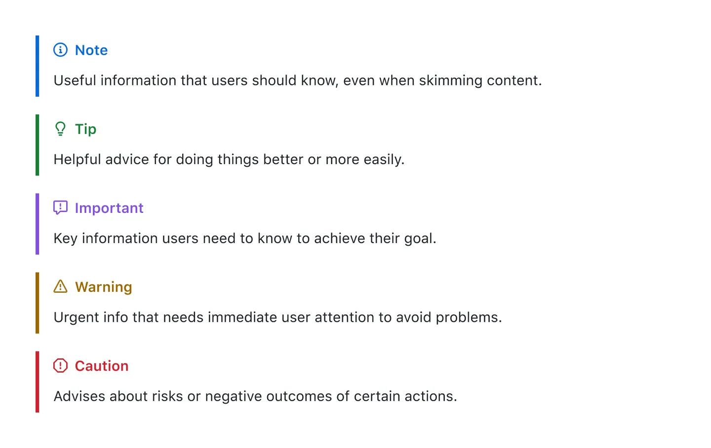

1.1 Propositional
Logic  
(Logica Proposicional)

1.2 Applications of
Propositional Logic   
(Aplicaciones de la Logica)

1.3 Propositional
Equivalences  
(Equivalencias Proposicionales)

1.4 Predicates and
Quantifiers  
(Predicados y Cuantificadores)

1.5 Nested
Quantifiers  
(Cuantificadores Anidados)

1.6 Rules of
Inference  
(Rgla de inferencia)

1.7 Introduction to
Proofs  
(Introduccion a las Demostraciones)

1.8 Proof Methods
and Strategy  
(Metodos y Estrategias de Demostraciones)

> [!NOTE]
> Useful information that users should know, even when skimming content.

> [!TIP]
> Helpful advice for doing things better or more easily.

> [!IMPORTANT]
> Key information users need to know to achieve their goal.

> [!WARNING]
> Urgent info that needs immediate user attention to avoid problems.

> [!CAUTION]
> Advises about risks or negative outcomes of certain actions.

